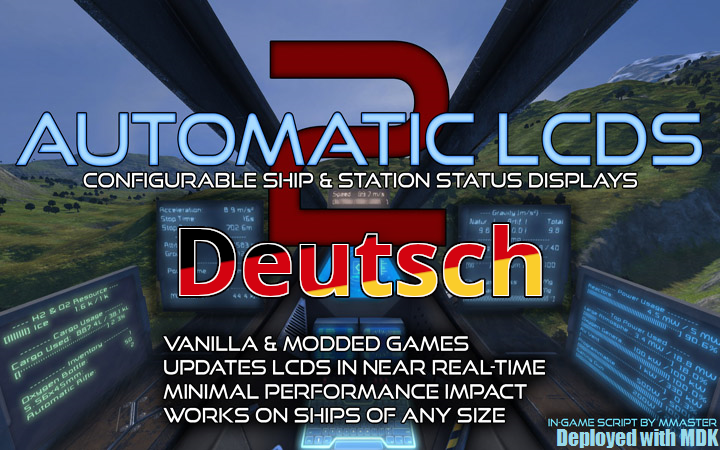

# Automatic LCDs 2 (Deutsch/German) [v2.0200]
> Deutsche Übersetzung des Skripts ['Automatic LCDs 2'](https://steamcommunity.com/sharedfiles/filedetails/?id=822950976) von MMaster.

</img>  
Verfügbar auf Steam: [Workshop/2888116433](https://steamcommunity.com/sharedfiles/filedetails/?id=2888116433)

## Anleitung
Eine ausfürhliche Anleitung auf Englisch ist hier zu finden:  
[MMaster's Automatic LCDs 2 Full Guide](https://steamcommunity.com/sharedfiles/filedetails/?id=407158161)

## Erklärvideo
Ein (etwas veraltetes) Erklärvideo auf Englisch kannst du hier finden:  
[YouTube/vqpPQ_20Xso](https://youtu.be/vqpPQ_20Xso)

## Funktionen
Steuert mehrere LCDs basierend auf Befehlen, die in den Benutzerdefinierten Daten eines LCD-Panels oder einer LCD-Leiste geschrieben wurden.
  * Ladeanzeige für Sprungantriebe
  * Sauerstoffdruck, Farmleistung & Tankinhalt!
  * Liste der beschädigten Blöcke mit Fortschrittsbalken!
  * Gefilterte Auflistung von Inventargegenständen und fehlenden Gegenständen
  * Reaktor-, Solar- und Batteriestatistiken
  * Anzeige der Blockdetails
  * Status von Türen, Getrieben und Anschlüssen
  * Munitionsbericht
  * Benutzerdefinierte Lauftextanzeige
  * Verknüpfte LCDs!
  * Funktioniert auf LCD-Panels, LCD-Leisten und deren modifizierten Gegenstücken!
  * Beliebige Schriftgröße!
  * Filterung von Blöcken nach Namen oder nach Gruppen
  * Frachtcontainer
  * Blockanzahl
  * Zusammenfassung/Liste von Produktion, Leerlauf und Statusanzeigen
  * Status der Antennen
  * Bremsweg und Bremszeit
  * Standort, Geschwindigkeit, Beschleunigung, Datum & Zeit, Schwerkraft
  * Schöner formatierter Text mit Fortschrittsbalken!
  * Mehrere Befehle in einem einzigen LCD!
  * Funktioniert auf jedem Server (mit aktivierten In-Game-Skripten)

KEINE PROGRAMMIERKENNTNISSE BENÖTIGT.
