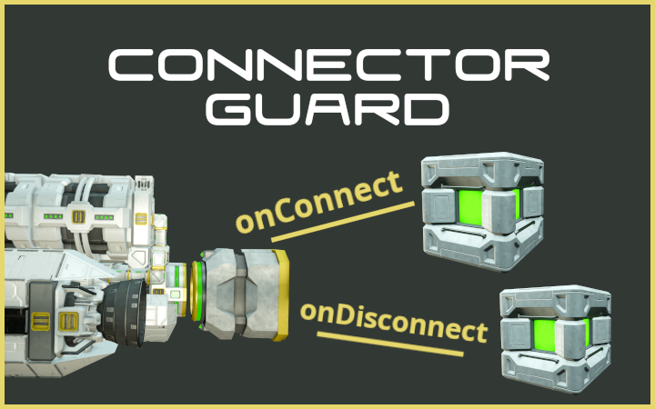
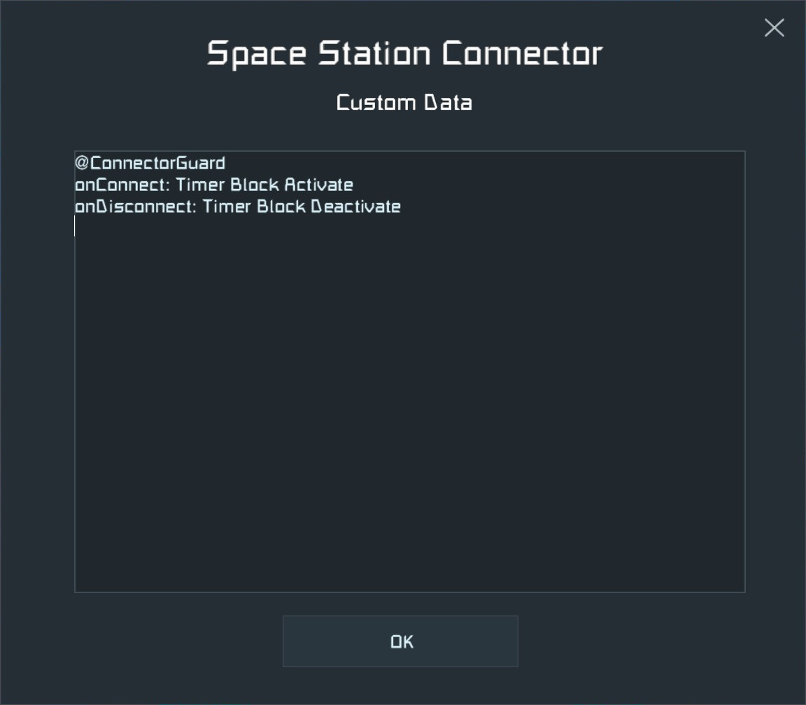

[](https://steamcommunity.com/sharedfiles/filedetails/?id=2889157900)
# Connector Guard
> Script to monitor connectors and run timer blocks when the connector is being connected/disconnected/approached.

</img>  
Available on Steam: [Workshop/2889157900](https://steamcommunity.com/sharedfiles/filedetails/?id=2889157900)


## Prerequisites
  * Experimental mode must be enabled!
  * Build a programmable block and load this script


## Instructions
  * Build a connector and 1-3 timer blocks (on the same construction as the programmable block)
  * In the <i>custom data</i> of the <b>connector</b>...
    * ... write "@ConnectorGuard" in the first line
    * (optional) ... add a line with "<b>onConnect</b>: &lt;timer block&gt;" to specify the timer block to run when the connector is being <i>connected</i>
    * (optional) ... add a line with "<b>onDisconnect</b>: &lt;timer block&gt;" to specify the timer block to run when the connector is being <i>disconnected</i>
    * (optional) ... add a line with "<b>onApproach</b>: &lt;timer block&gt;" to specify the timer block to run when the connector <i>can connect</i> (but is not yet connected) and was <i>previously disconnected</i>
  * In each timer block...
    * ... set the delay to 00:00:01
    * ... configure the actions to be executed when the timer block is being run

_Note that you can specify any combination of onConnect, onDisconnect and onApproach, in any order. You can also use the same timer block for multiple actions._


## Examples
A connector that runs "Timer Block 1" on connect and "Timer Block 2" on disconnect has custom data:
```
@ConnectorGuard
onConnect: Timer Block 1
onDisconnect: Timer Block 2
```

A connector that runs "Timer Block 3" on connect and approach has custom data:
```
@ConnectorGuard
onApproach: Timer Block 3
onConnect: Timer Block 3
```

A connector that runs "Timer Block Activate" on connect and "Timer Block Deactivate" on disconnect has custom data:
</img>
