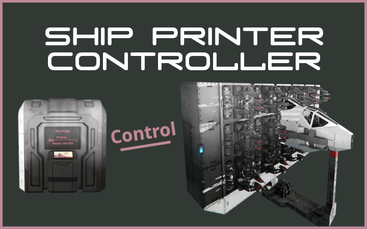
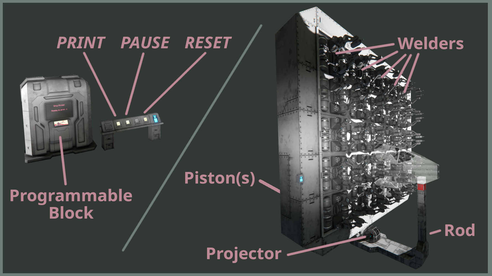

[](https://steamcommunity.com/sharedfiles/filedetails/?id=3211334252)
# Ship Printer Controller
> Script to automate a ship printer by controlling the pistons, welders and the projector.

</img>  
Available on Steam: [Workshop/3211334252](https://steamcommunity.com/sharedfiles/filedetails/?id=3211334252)


## Prerequisites
  * Experimental mode must be enabled!


## Setup
</img>
  * Build a ship printer with...
    * ... one or more <b>Piston(s)</b> that are connected to a grid (of the size of your choice) where you build a <b>Rod</b>
    * ... a <b>Projector</b> on the grid with the <b>Rod</b>
    * ... many ship <b>Welders</b> that are connected to a cargo container holding enough resources to build the ship
  * Build a <b>Programmable Block</b> and load this script
  * Build a button panel (or a similar block that lets you assign actions) and assign three actions. Select the <b>Programmable Block</b> with the <i>Run</i> action and enter the arguments <b><i>PRINT</i></b>, <b><i>PAUSE</i></b> and <b><i>RESET</i></b>, respectively.


## Configure
Configure the script in the <b>Programmable Block</b>
```c#
// Block Names (required)
const string pistonName = "Piston (Ship Printer)";
const string welderName = "Welder (Ship Printer)";
const string projectorName = "Projector (Ship Printer)";

// Block Names (optional)
const string speakerName = "Speaker (Ship Printer)";

// Speeds & Wait Times (modify as needed)
const float printSpeed = 0.1f; // default: 0.1f
[...]
const int weldingDelay = (int) (6.06f * 3); // default: 3 [seconds]

// Programmable Block Display (modify as needed)
[...]
```
  * Enter the block names (required)
    * for <i>pistonName</i> enter the name of your <b>Piston(s)</b> (all pistons must have the same name)
    * for <i>welderName</i> enter the name of your <b>Welders</b> (all welders must have the same name)
    * for <i>projectorName</i> enter the name of your <b>Projector</b>
  * Enter the block names (optional)
    * for <i>speakerName</i> enter the name of your speaker if you want to hear a sound when a print starts and ends
  * Adjust the speeds and wait times (modify as needed)
    * for <i>printSpeed</i>, lower values ensure that all blocks are welded, higher values reduce print times
    * for <i>weldingDelay</i>, higher values ensure that all blocks are welded, lower values reduce print times


## Instructions
  * Configure the <b>Projector</b> to show the desired print and position it such that it touches the <b>Rod</b>
  * Start the print by pressing the <b><i>PRINT</i></b> button (or running the script with the <b><i>PRINT</i></b> argument)
  * Wait until the print is finished...
    * You can pause the print by pressing the <b><i>PAUSE</i></b> button (or running the script with the <b><i>PAUSE</i></b> argument)
  * Remove the ship from the <b>Rod</b> and fly it away
  * Reset the printer by pressing the <b><i>RESET</i></b> button (or running the script with the <b><i>RESET</i></b> argument)

## Note
  * Run the script with the <b><i>RESTART</i></b> argument to fully restart / factory reset it.
