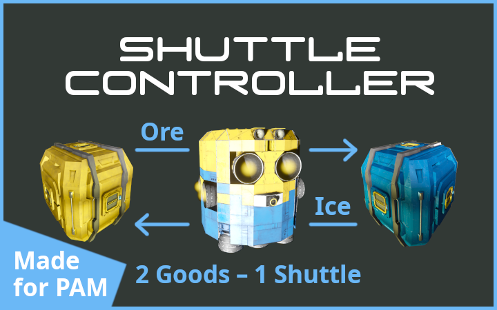

[](https://steamcommunity.com/sharedfiles/filedetails/?id=3211336732)
# Shuttle Controller
> Script to operate a shuttle that transports one resource on the outward journey and another resource on the return journey by monitoring free container space and (de-)activating sorters to load the ship with the required quantity. Designed to work with the <i>Shuttle Mode</i> of ['[PAM] Path Auto Miner'](https://steamcommunity.com/sharedfiles/filedetails/?id=1507646929) by Keks.

</img>  
Available on Steam: [Workshop/3211336732](https://steamcommunity.com/sharedfiles/filedetails/?id=3211336732)


## Prerequisites
  * Experimental mode must be enabled!
  * Build a <b>Programmable Block</b> on your shuttle <b>Ship</b> and load this script
  * (optional) Configure ['[PAM] Path Auto Miner'](https://steamcommunity.com/sharedfiles/filedetails/?id=1507646929) by Keks on your <b>Ship</b> in <i>Shuttle Mode</i>


## Example
On <i>Station A</i> you mine <i>Ore</i>, but you have no access to refineries and <i>Ice</i>.  
On <i>Station B</i> you have <i>Ice</i> and refineries, but you have no access to <i>Ore</i>.  
You want to use a single <b>Ship</b> to transport <i>Ore</i> from <i>Station A</i> to <i>Station B</i>, and on the return journey you want use the same <b>Ship</b> to transport <i>Ice</i> from <i>Station B</i> to <i>Station A</i>, and so on.  
Normally you run into problems when the <b>Ship</b> is full of <i>Ice</i> but your containers on <i>Station A</i> have no more free space, because you cannot unload the <b>Ship</b> and therefore you cannot load any more <i>Ore</i> to transport it to <i>Station B</i>.  
This is where <i>Shuttle Controller</i> comes into play. It measures the free container space on each station and only loads as much goods as it can unload later.

You build the following connections:
  * On <i>Station A</i> build <i>Ice</i> <b>Containers</b> and a conveyor system with a <b>Conveyor Sorter</b> that <i>fetches</i> all <i>Ice</i> from the <b>Ship</b>. This <b>Container</b> is monitored by the script; these <b>Sorters</b> are always enabled and not used by the script.
  * On <i>Station A</i> build <i>Ore</i> <b>Containers</b> and a conveyor system with a <b>Conveyor Sorter</b> that <i>loads</i> all <i>Ore</i> onto the <b>Ship</b>. This <b>Container</b> is not used by the script; these <b>Sorters</b> are (de-)activated by the script.
  * On <i>Station B</i> build <i>Ore</i> <b>Containers</b> and a conveyor system with a <b>Conveyor Sorter</b> that <i>fetches</i> all <i>Ore</i> from the <b>Ship</b>. This <b>Container</b> is monitored by the script; these <b>Sorters</b> are always enabled and not used by the script.
  * On <i>Station B</i> build <i>Ice</i> <b>Containers</b> and a conveyor system with a <b>Conveyor Sorter</b> that <i>loads</i> all <i>Ice</i> onto the <b>Ship</b>. This <b>Container</b> is not used by the script; these <b>Sorters</b> are (de-)activated by the script.


## Configure
Configure the script in the <b>Programmable Block</b> of your <b>Ship</b>
```c#
// Blocks on this Ship
const string connectorName = "My Ship's Connector";
const string containerName = "My Ship's Container";
const string pamBlockName = "My Ship's Programmable Block with PAM"; // optional

// All Constructions that can be approached...
[...]
static List<string> identifiers = new List<string> {
    "Station A",
    "Station B",
};
static List<string> connectorNames = new List<string> {
    "Connector on Station A",
    "Connector on Station B",
};
static List<string> containerGroupNames = new List<string> {
    "Group of Ore Containers on Station A",
    "Group of Ice Containers on Station B",
};
static List<List<string>> sorterNames = new List<List<string>> {
    new List<string> { null, "Sorter to load Ore on Station B" },
    new List<string> { "Sorter to load Ice on Station A", null},
};

// Misc (modify as needed)
const long largeContainerSize = 421875L * 1000L * 3L; // size of a large container w/ multiplier 3x
[...]
const double tankMinimumFill = 0.95d; // default: 0.95d
const float batteryMinimumStoredPower = 0.90f; // default: 0.90f

// Programmable Block Display (modify as needed)
[...]
```
  * Enter the block names (required)
    * for <i>connectorName</i> enter the name of the <b>Connector</b> of your <b>Ship</b>
    * for <i>containerName</i> enter the name of the <b>Container(s)</b> of your <b>Ship</b> (all containers must have the same name)
    * for <i>pamBlockName</i> enter the name of the <b>Programmable Block</b> running ['PAM'](https://steamcommunity.com/sharedfiles/filedetails/?id=1507646929) in <i>Shuttle Mode</i>
  * Configure the jobs (required)
    * Note: To implement the above example, we have two entries for each list, but theoretically more entries are possible.
    * for <i>identifiers</i> enter arbitrary nicknames for the individual docking stations, e.g. the names of the stations
	* for <i>connectorNames</i> enter the name of the <b>Connector</b> to which your <b>Ship</b> docks at each station
	* for <i>containerGroupNames</i> enter the name of the <b>Group of Containers</b> to monitor on each station
      * Note: These are the <b>Containers</b> in which the goods are stored that you want to load onto your <b>Ship</b> and take elsewhere, not the ones with the goods you want to import.
	* for <i>sorterNames</i> enter the name of the <b>Sorter(s)</b> that load goods onto your <b>Ship</b> for each station
	  * Note: These are the <b>Sorters</b> that handle the goods you want to load onto your <b>Ship</b> and take elsewhere, not the ones that handle the goods you want to unload.
	  * Note: With two stations, as in the example, you only change the strings and leave the <i>null</i> entries untouched.
  * Adjust the behavior (modify as needed)
    * for <i>largeContainerSize</i> change the value at the end, i.e. the <i>3L</i>, to the multiplier value you are playing with
	  * Note: This is purely cosmetic. The script shows you container capacities in the output of the programmable block as multiples of this value.
    * for <i>tankMinimumFill</i> enter the required filling level of gas tanks before departure
	* for <i>batteryMinimumStoredPower</i> enter the required charging level of batteries before departure


## Instructions
  * Simply run the script

## Note
  * Run the script with the <b><i>RESTART</i></b> argument to fully restart / factory reset it.
